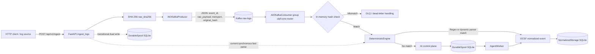
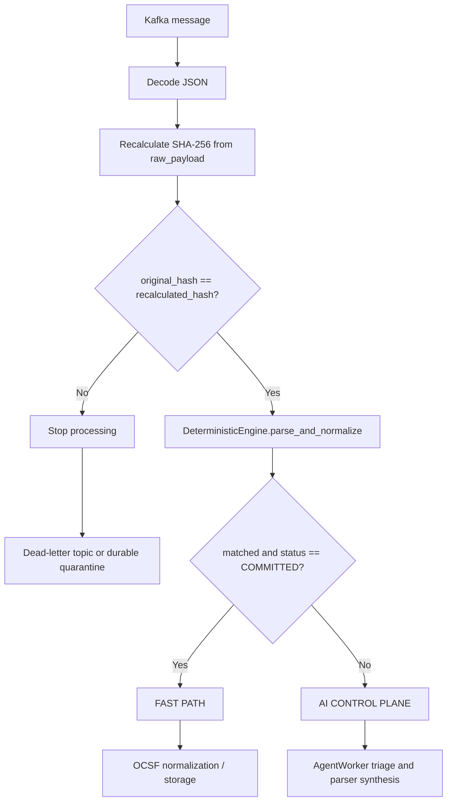

# ULPF System Analysis

## Scope and evidence

This analysis is based on the checked-in implementation, primarily:

- `ulpf/listener.py`
- `ulpf/kafka_consumer.py`
- `docker-compose.yml`
- Supporting implementations used by those files: `ulpf/models.py`, `ulpf/engine.py`, `ulpf/spool.py`, `ulpf/agent_worker.py`, and `ulpf/storage.py`

The report distinguishes the target architecture suggested by the Kafka integration from the behavior that is actually executable in the current repository. No Kafka DLQ producer, Kafka topic declaration, or separate consumer service is present in `docker-compose.yml`.

## 1. System architecture overview

ULPF is structured as a local, event-oriented log pre-processing system with three conceptual planes:

1. **Ingress and durability plane.** FastAPI exposes HTTP ingestion. `listener.py` creates an `EventEnvelope`, computes a SHA-256 digest for each raw string, publishes a JSON record to Kafka topic `raw-logs`, and also writes an envelope to the SQLite-backed `DurableSpool`.
2. **Deterministic data plane.** `DeterministicEngine` applies built-in regular-expression parsers and then dynamic registry parsers. A match produces an OCSF-style event and sets `EventStatus.COMMITTED`; otherwise the envelope is marked `PENDING_AI`.
3. **Agentic control plane.** `AgentWorker` polls `DurableSpool` for `PENDING_AI` records, clusters/synthesizes parsers through the agent, and can commit newly normalized events or quarantine repeated failures.

Kafka is configured as a single-node Apache Kafka broker using KRaft controller/broker mode. The producer and consumer use `aiokafka`; the advertised client endpoint is `localhost:9092`. This is a local development topology, not a demonstrated production-grade zero-trust deployment: the compose file uses plaintext listeners, one broker/controller, replication factor one, and does not define network isolation, authentication, authorization, TLS, or a consumer service.

The phrase **air-gapped** is therefore an architectural intent that is compatible with local-only processing and an on-premises Kafka broker, but it is not enforced by the supplied compose configuration. Likewise, the cryptographic check is an integrity check against the hash carried in the message; it is not sender authentication or provenance attestation because the message is not signed and Kafka is configured with `PLAINTEXT`.

## 2. Component wiring and data flow

### 2.1 Runtime initialization

The FastAPI lifespan function constructs:

```text
DurableSpool("ulpf_spool.db")
NormalizedStorage("ulpf_storage.db")
DynamicParserRegistry()
DeterministicEngine(registry=registry)
AgentWorker(spool, storage, registry, engine)
```

It stores those objects on `app.state`, creates `AIOKafkaProducer` with `KAFKA_BOOTSTRAP_SERVERS` or `localhost:9092`, awaits `kafka_producer.start()`, starts the UDP syslog listener, and launches `worker.run()` as an asyncio task. Shutdown stops the worker, closes UDP, and awaits `kafka_producer.stop()`.

The compose file only starts `ulpf-kafka`. The FastAPI application and the Kafka consumer are expected to be started separately; no `backend` or `consumer` service is declared there.

### 2.2 HTTP ingestion lifecycle

For `POST /api/v1/ingest`, the implementation in `ingest_logs()` performs the following operations for each `payloads` item:

1. Validate that every line is non-empty through `IngestRequest` and an explicit whitespace check.
2. Construct `EventEnvelope(raw_payload=raw_payload, source_transport=...)`. `EventEnvelope.model_post_init()` computes `raw_sha256` if it was not supplied.
3. Independently compute `raw_sha256 = hashlib.sha256(raw_payload.encode('utf-8')).hexdigest()` in the listener.
4. Build the Kafka dictionary containing `event_id`, `raw_payload`, `transport`, and `original_hash`.
5. Serialize it with `json.dumps(...)` and call `await kafka_producer.send_and_wait("raw-logs", ...)`.
6. Call `spool.enqueue(envelope)`, which is an alias for SQLite-backed `DurableSpool.spool()` and persists the raw event in `ulpf_spool.db` using WAL mode.
7. Immediately call `engine.parse_and_normalize(envelope)` in the HTTP handler. A deterministic match is synchronously committed through `storage.commit_event(parsed_event)` and the spool status is changed to `COMMITTED`; a miss is changed to `PENDING_AI`.
8. Return `IngestResponse` with counts and event IDs.

The Kafka publish is protected by a nested `try/except`: a publish exception is logged, but ingestion continues to the SQLite spool and local parse. Consequently, the current endpoint has a local durable fallback, but it does not fail the request when Kafka delivery fails.

### 2.3 Kafka consumer lifecycle

The intended consumer configuration is:

```python
AIOKafkaConsumer(
    "raw-logs",
    bootstrap_servers="localhost:9092",
    group_id="ulpf-core-router",
    auto_offset_reset="earliest",
)
```

`consume_and_verify()` starts the consumer and asynchronously iterates over records. For each record, it decodes JSON and extracts `event_id`, `raw_payload`, `transport`, and `original_hash`. It recalculates the digest in memory as:

```python
recalculated_hash = hashlib.sha256(raw_payload.encode('utf-8')).hexdigest()
```

The intended decision is:

- equal `original_hash` and `recalculated_hash`: integrity verified; route to deterministic fast path if `matched` and status is `COMMITTED`, otherwise route to the AI control plane;
- unequal hashes: declare tampering and route to a DLQ.

However, the current ordering does not implement that decision safely. `kafka_consumer.py` constructs an `EventEnvelope` and invokes `engine.parse_and_normalize(envelope)` **before** the hash comparison. The file also does not import `EventEnvelope` or `EventStatus`, and it never defines or constructs `engine`. As written, the first successfully decoded record reaches a `NameError` before the integrity branch. The DLQ branch only prints a message; it does not publish to a DLQ topic, persist a `DEAD_LETTER` envelope, or call `DurableSpool.quarantine_event()`.

### 2.4 Deterministic normalization and AI routing

`DeterministicEngine.parse_and_normalize()` tests, in order, Palo Alto CEF, firewall key/value, and Linux SSH/auth signatures, then invokes `DynamicParserRegistry.apply_parsers()`. A successful built-in parse creates `OCSFNetworkActivity`, sets `parser_id`, `parser_version`, and `EventStatus.COMMITTED`. A miss sets `EventStatus.PENDING_AI`.

In the FastAPI path, the AI route is implemented through the SQLite spool and `AgentWorker`, not through the Kafka consumer. `AgentWorker.run()` polls, invokes the parser-synthesis agent, commits successful outputs, and increments retries/quarantines poison pills after the configured retry limit. The Kafka consumer's printed “AI CONTROL PLANE” decision is therefore a routing indication, not a completed handoff to an AI Kafka topic or another queue.

## 3. Visual architecture diagrams

### 3.1 Intended asynchronous event flow



The dashed paths show behavior currently retained in `listener.py`. In a fully decoupled target, the producer path would stop after the Kafka handoff (plus any explicitly required durability policy), while the consumer would own verification and deterministic routing.

### 3.2 Verified routing decision



The second diagram is the required safe ordering. The checked-in consumer does not currently follow it: its engine call occurs before `C`, and its `DLQ` node is only a console print.

## 4. Architectural verification and performance analysis

### 4.1 Throughput and concurrency validation

**Expected architectural benefit.** Kafka provides a durable asynchronous boundary, and `AIOKafkaProducer` allows an async FastAPI handler to publish to `raw-logs` without running parsing inside the producer process. A separately scaled consumer group could pull records concurrently, and Kafka retains records for consumers that are temporarily offline because `auto_offset_reset="earliest"` is configured. This can increase ingress throughput and smooth bursts by shifting expensive parsing/AI work behind the broker.

**What is actually implemented.** The benefit is not realized end-to-end by `ingest_logs()` today. After `await kafka_producer.send_and_wait(...)`, the request still executes:

```python
spool.enqueue(envelope)
matched, parsed_event = engine.parse_and_normalize(envelope)
storage.commit_event(parsed_event)
spool.update_status(...)
```

`send_and_wait` also waits for broker acknowledgement for every payload, and the loop processes the batch serially. `DurableSpool.spool()`, `DeterministicEngine.parse_and_normalize()`, and `NormalizedStorage.commit_event()` are synchronous calls inside an async endpoint. The handler therefore remains coupled to SQLite and deterministic parsing latency. In addition, the consumer is not runnable as written because of the missing symbols described above. The code demonstrates the intended concurrency boundary, but it does not yet prove a measured throughput increase.

### 4.2 Stateless verification and zero database reads

The cryptographic comparison itself is stateless and in-memory:

1. `listener.py` computes `original_hash` from the raw UTF-8 payload before producing the Kafka record.
2. The producer includes that digest in the JSON message under the exact key `original_hash`.
3. `kafka_consumer.py` extracts `original_hash`, recomputes the digest from `raw_payload`, and compares the strings.

This verification algorithm does not need a SQLite lookup of the original payload or digest. It therefore bypasses SQLite disk-read latency for the integrity decision.

The stronger claim “zero database reads for the complete consumer path” is not verified by the repository. The consumer does not currently load the spool, storage, or engine, and it has no working handoff implementation. Separately, the HTTP path intentionally writes to SQLite and the metrics/events endpoints read SQLite. The architecture has a zero-DB-read integrity check, not a zero-DB-I/O application overall.

There is also no message authentication code or signature. A party able to rewrite both `raw_payload` and `original_hash` could produce a self-consistent pair; the hash protects accidental or one-sided tampering, not an unauthenticated producer boundary.

### 4.3 Database locking and decoupling

The intended decoupling is sound: Kafka should absorb bursts, while a background consumer/worker performs parsing and downstream writes. That would reduce the number of concurrent HTTP requests contending for SQLite and reduce the chance of `database is locked` during log storms. `DurableSpool` already uses SQLite WAL mode, `busy_timeout=5000`, a 30-second connection timeout, and short context-managed transactions, which helps contention but does not make SQLite a high-concurrency event store.

The current implementation retains a **dual-write transitional safety net** in `listener.py`: each HTTP event is sent to Kafka and then inserted into `DurableSpool`; the same request also parses and may write `NormalizedStorage`. This is useful for a hackathon because a Kafka outage does not discard the local spool record, and existing `AgentWorker` behavior continues to function. It also means the API still pays SQLite and parsing costs, creates duplicate processing paths, and has no transactional atomicity between Kafka and SQLite. A Kafka success followed by a local failure, or a Kafka failure followed by local success, can produce divergent paths.

Thus, the code supports the diagnosis that decoupling *would* relieve SQLite contention, but the present dual-write/synchronous design has not yet completed that decoupling.

### 4.4 Defensive routing and DLQ verification

The intended conditional is explicit: compare `original_hash` with `recalculated_hash`; on mismatch, print “TAMPERING DETECTED” and “ROUTED TO DEAD-LETTER QUEUE (DLQ)”; on a match, use `matched` and `parsed_event.status == EventStatus.COMMITTED` to distinguish FAST PATH from AI CONTROL PLANE.

The implementation does **not** currently satisfy the required defensive guarantee:

- `engine.parse_and_normalize(envelope)` runs before the hash mismatch branch, so tampered data is not halted before parsing.
- `EventEnvelope`, `EventStatus`, and `engine` are unresolved in `kafka_consumer.py`, causing runtime failure before routing.
- No Kafka DLQ topic is configured or produced to.
- No consumer-side durable `DEAD_LETTER` status update is performed.
- `EventStatus.DEAD_LETTER` exists in `models.py`, but the consumer does not use it. `DurableSpool` exposes quarantine behavior, but the consumer does not call it.
- Clean verified events are only printed as “NORMALIZED TO OCSF”; the consumer does not call `NormalizedStorage.commit_event()`.

The defensive-routing logic is therefore a presentational skeleton rather than a verified implementation. To make the claimed behavior real, the consumer must initialize/import its engine and models, perform the hash comparison before constructing/parsing the envelope, implement an actual DLQ or durable quarantine action, and commit verified normalized events through an explicitly owned storage path.

## 5. Bottom-line assessment

ULPF contains the core building blocks for a Kafka-buffered, integrity-checked, deterministic-plus-agentic pipeline: `AIOKafkaProducer`, the `raw-logs` topic contract, `original_hash`, in-memory SHA-256 recomputation, `DeterministicEngine`, a WAL-backed spool, and an asynchronous `AgentWorker`. The repository currently represents a hybrid migration state rather than a completed decoupled architecture. Kafka is added alongside the original synchronous SQLite/engine path; the consumer's verification/routing skeleton is not executable; and DLQ/OCSF side effects are not wired.

The strongest claims supported by the code are: Kafka publication is attempted asynchronously; the hash comparison can be performed without a database read; and a background worker already exists for AI triage. The claims that the HTTP bottleneck has been eliminated, that the running consumer halts tampered logs, and that a real DLQ receives them are not supported by the current implementation.
